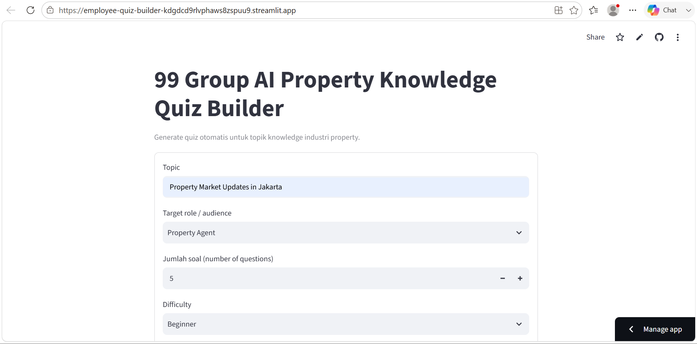
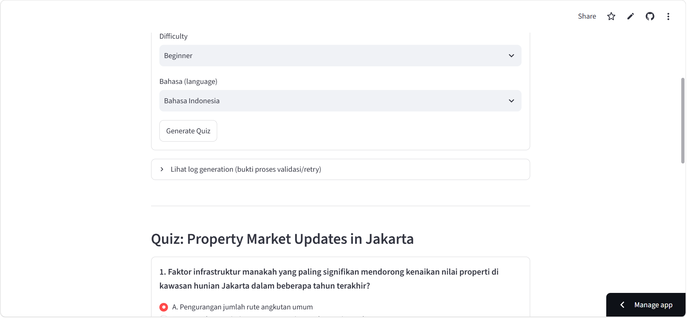
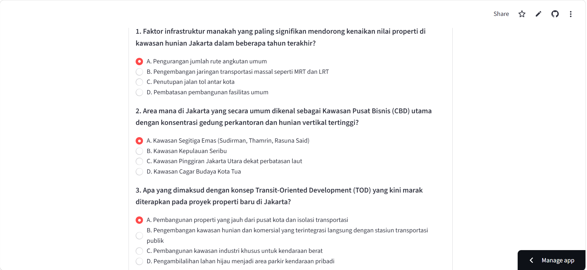
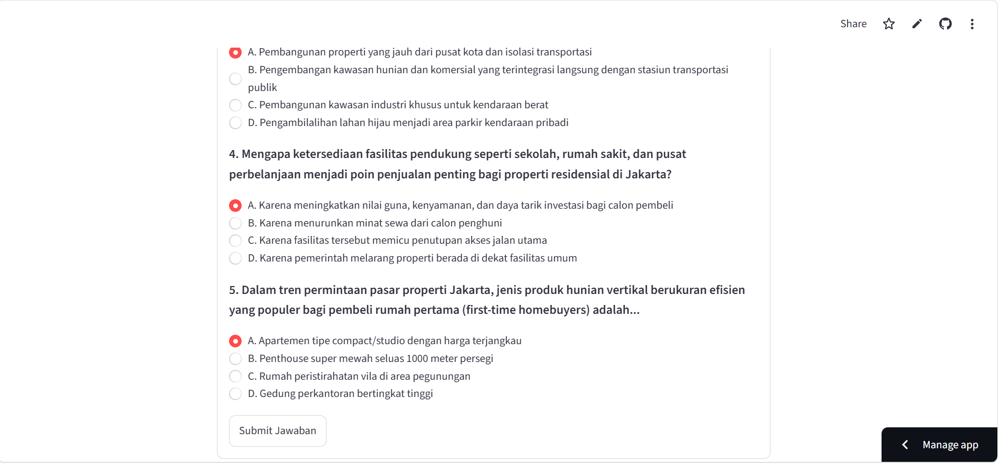
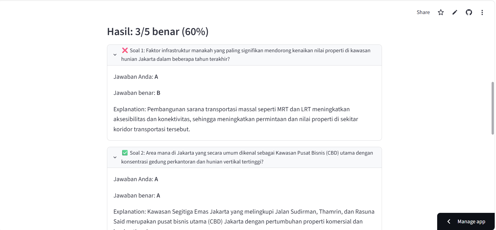
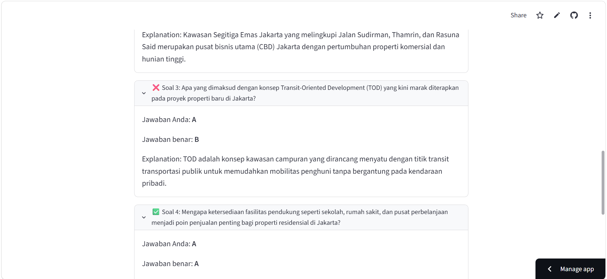
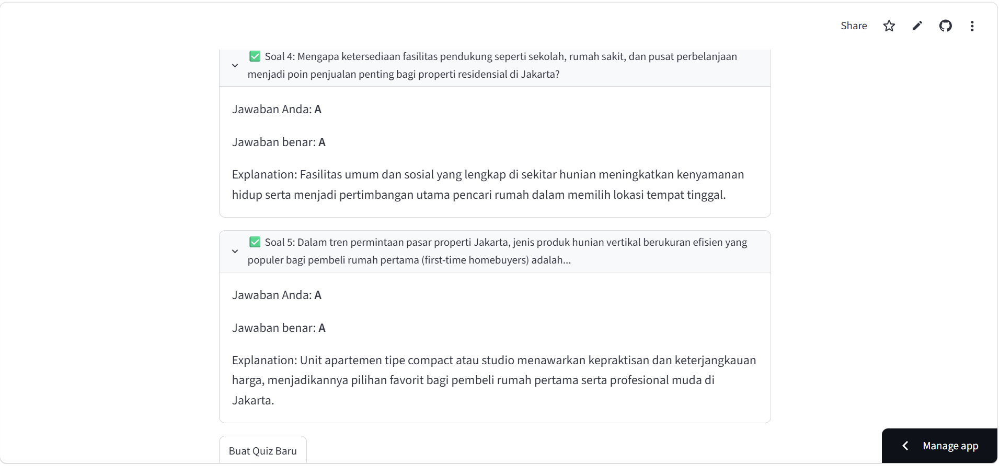

<div class="hero">

<h1>🧠 Property Knowledge Quiz Builder</h1>

<p>AI Quiz Generation · LLM-as-Judge Quality Gate · Interactive Assessment</p>

<p>
  
  
  
  
  
  
</p>

<p>
An end-to-end AI pipeline that turns a single topic string into a validated,
schema-conformant multiple-choice quiz — reviewed by a second AI, self-corrected
on failure, and delivered as an interactive, scored experience.
</p>

</div>

---

## 📖 Project Overview

This project is an **AI-powered quiz generation system** built for employee knowledge training at 99 Group, a property industry organization.

Rather than a single "ask an LLM, hope it's right" call, the system treats quiz generation as a **pipeline with independent quality gates** — because a quiz with a broken question, a duplicate, or an unfair distractor is worse than no quiz at all.

```text
Topic Input
     ↓
Prompt Construction
     ↓
Gemini API (Structured Generation)
     ↓
Programmatic Validation
     ↓
AI Quality Assurance (LLM-as-Judge)
     ↓
   Pass? ── No ──→ Retry (up to 3x)
     │ Yes
     ↓
Interactive Quiz
     ↓
Automatic Scoring
     ↓
Feedback + Explanations
```

> **Core philosophy:** an AI feature is only as trustworthy as its worst unreviewed output. This project treats validation and quality review as first-class pipeline stages, not afterthoughts — every quiz a user sees has already survived two independent reviewers before they do.

---

## 🎯 Project Objectives

1. Convert a single topic string into a complete, well-structured multiple-choice quiz without manual authoring.
2. Guarantee output that is machine-parseable and schema-conformant — not just "AI text that looks like JSON."
3. Catch structural errors (wrong question count, duplicate questions, malformed options) before a human ever sees them.
4. Catch semantic errors (irrelevant questions, unfair distractors, inconsistent explanations) using a second AI reviewer, not just a human eyeballing the result.
5. Recover automatically from failed generations instead of surfacing raw errors to the end user.
6. Deliver the finished quiz as a usable, interactive experience — not a raw JSON blob — with immediate scoring and explanations.
7. Keep the entire pipeline runnable at zero cost on free-tier infrastructure.

---

## ✨ Key Features

### 🧬 Schema-Constrained Generation

Instead of asking the model to "please return JSON," every quiz request is paired with a **Pydantic schema** passed directly to the Gemini API via `response_schema`. Generation is constrained at the API level, and the SDK returns fully-typed Python objects — not a string that might or might not parse.

### 🛡️ Two-Stage Quality Gate

- **Programmatic validation** — deterministic, zero-cost checks: question count, duplicate detection, empty/duplicate options, difficulty match.
- **AI Quality Assurance ("LLM-as-Judge")** — a second, independent Gemini call reviews the *already-generated* quiz for topic relevance, defensible distractors, ambiguity, and explanation consistency — the class of problems no type check can catch.

### 🔁 Self-Healing Retry Loop

If either gate fails, the pipeline regenerates automatically (up to 3 attempts) instead of showing the user a broken quiz or a stack trace. Every attempt is logged, producing a transparent, inspectable trail of what was tried and why it passed or failed.

### 🎛️ Configurable Generation

Topic, target audience (Property Agent / Sales / Marketing / Customer Support / New Employee), question count, difficulty (Beginner / Intermediate / Advanced), and language are all first-class inputs — one pipeline adapts across five roles and two languages without code changes.

### 🎮 Interactive Assessment Experience

The generated quiz isn't dumped as raw text — it's rendered as an actual multiple-choice quiz with per-question inputs, instant scoring, and per-question explanations, built entirely with Streamlit's `session_state` (no separate frontend framework).

### 📜 Transparent Generation Log

Every generation attempt — pass or fail, and why — is surfaced in an expandable log panel, turning "the AI just works" into "here is exactly what the AI did and how it corrected itself."

---

## 🧠 AI Workflow

```text
Input
 ↓
Construct Prompt
 ↓
Generate (Gemini API)
 ↓
Validate
 ↓
Review (AI QA)
 ↓
Retry or Proceed
 ↓
Present
 ↓
Score
 ↓
Explain
```

---

## 📐 Design Principles

### 1. Fail Loud Internally, Fail Quiet Externally

Every validation and QA failure is logged in detail for debugging, but the end user only ever sees a finished quiz or a single clear message — never a stack trace or a malformed question.

### 2. Separate What the Model Generates from What the Code Guarantees

The LLM owns content quality. Pydantic and plain Python own structural guarantees. Neither is trusted to do the other's job.

### 3. Two Independent Reviewers, Not One

Structural checks and quality checks are deliberately split across two different mechanisms — deterministic code vs. a second LLM call — so they don't share the same blind spots.

### 4. Compose Small, Single-Purpose Modules

Prompt construction, API access, validation, QA, and orchestration each live in their own module, independently readable and testable.

### 5. Zero Cost by Default

Every model call targets Gemini's free tier, and the app deploys on Streamlit Community Cloud's free tier — the whole system runs at $0.

---

## 🗂️ Core Components

| Component | Purpose |
|---|---|
| 📋 **Prompt Builder** | Turns user input into a constrained generation prompt |
| 🤖 **Gemini Client** | Handles all communication with the Gemini API, including structured output |
| 🧩 **Pydantic Schemas** | Define the exact shape of a valid quiz and a valid QA result |
| ✅ **Programmatic Validator** | Deterministic, zero-cost structural checks |
| 🧑‍⚖️ **AI QA Checker** | Second LLM call acting as an independent quality reviewer |
| 🔁 **Quiz Pipeline** | Orchestrates generation → validation → QA → retry |
| 🎮 **Interactive UI** | Session-state–driven quiz-taking and scoring experience |

---

## 🔬 Technical Implementation

### Structured Output via `response_schema`

```text
Pydantic Model
     ↓
response_schema (Gemini API)
     ↓
Constrained Generation
     ↓
response.parsed → typed Python object
```

### LLM-as-Judge Quality Review

A second, independently-prompted Gemini call receives the already-generated quiz and is asked to **judge it, not regenerate it**, against five concrete criteria: relevance, distractor defensibility, ambiguity, explanation consistency, and factual plausibility.

### Retry With Backoff

```text
Attempt fails
     ↓
Log the reason
     ↓
Short delay (rate-limit friendly)
     ↓
Retry (up to 3x)
     ↓
Fail gracefully with a clear message
```

---

## 🛡️ Quality Assurance Framework

```text
                  QUIZ REQUEST
                       │
          ┌────────────┼────────────┐
          ↓            ↓            ↓
     Structural     Semantic      Business
      Validity       Quality        Rules
   (Pydantic +    (AI QA via     (count, role,
     Python)        2nd LLM)      difficulty)
          │            │            │
          └────────────┼────────────┘
                       ↓
                Pass / Retry Decision
                       ↓
                Interactive Quiz
```

---

## 🧪 Testing & Iteration

The pipeline's own retry/validation loop functions as a form of **continuous, automated testing at runtime** — every single generation is checked against the same criteria a human reviewer would use, not just once during development.

During development, the pipeline was exercised manually against multiple real property-industry topics — including *Property Market Updates in Jakarta*, *Basic KPR Knowledge*, and *Top Skills of a Property Agent* — across different roles, difficulty levels, and languages, to confirm the generate → validate → QA → retry cycle behaves correctly end-to-end.

> Honesty note: this section intentionally avoids invented metrics. See **Known Limitations** below for a candid account of what the current system does *not* yet guarantee.

---

## 📈 From Prompt to Assessment

```text
Topic
  ↓
Structured Prompt
  ↓
Constrained Generation
  ↓
Automated Review
  ↓
Verified Quiz
  ↓
Human Interaction
  ↓
Instant Feedback
  ↓
Retained Knowledge
```

---

## 🛠️ Technology Stack

| Layer | Technology | Purpose |
|---|---|---|
| 🖥️ **Interface** | Streamlit | Single-language UI + backend, no separate frontend |
| 🧠 **Generation** | Google Gemini API (`gemini-2.5-flash`) | Quiz content generation with structured output |
| 📦 **SDK** | `google-genai` | Official Python client for the Gemini API |
| 🧩 **Validation** | Pydantic | Schema definition, type enforcement, structured parsing |
| 🔐 **Config** | `python-dotenv` | Local secret management via `.env` |
| 🗂️ **Version Control** | Git + GitHub | Source control, public repository |
| ☁️ **Deployment** | Streamlit Community Cloud | Free public hosting |

---

## 🖥️ System Architecture

### 📥 Input Layer

The Streamlit form collecting topic, role, question count, difficulty, and language.

### 🤖 Generation Layer

Prompt construction and schema-constrained generation via the Gemini API.

### 🛡️ Assurance Layer

Programmatic validation, AI-based quality review, and the retry loop that ties them together.

### 🎮 Presentation Layer

The interactive quiz UI, scoring logic, and feedback display.

```text
┌────────────────────────┐
│      INPUT LAYER       │
│   Streamlit Form (UI)  │
└────────────┬───────────┘
             ↓
┌────────────────────────┐
│    GENERATION LAYER    │
│  Prompt Builder + Gemini│
│   (Structured Output)  │
└────────────┬───────────┘
             ↓
┌────────────────────────┐
│    ASSURANCE LAYER     │
│ Programmatic Validation │
│   + AI QA + Retry Loop │
└────────────┬───────────┘
             ↓
┌────────────────────────┐
│   PRESENTATION LAYER   │
│  Interactive Quiz UI   │
│   Scoring + Feedback   │
└────────────────────────┘
```

---

## 🗺️ Project Scope

| Module | Description | Status |
|---|---|---|
| 🎛️ Configurable Input | Topic, role, count, difficulty, language | ✅ Implemented |
| 🤖 AI Generation | Structured quiz generation via Gemini API | ✅ Implemented |
| ✅ Programmatic Validation | Count, duplicates, empty/duplicate options, difficulty match | ✅ Implemented |
| 🧑‍⚖️ AI Quality Assurance | LLM-as-judge review of relevance & fairness | ✅ Implemented |
| 🔁 Retry / Regeneration | Automatic recovery on validation/QA failure | ✅ Implemented |
| 🎮 Interactive Quiz | Session-state–driven quiz-taking UI | ✅ Implemented |
| 🧮 Automatic Scoring | Instant scoring with per-question explanations | ✅ Implemented |
| 📜 Generation Log | Attempt-by-attempt audit trail | ✅ Implemented |
| ☁️ Public Deployment | Live demo on Streamlit Community Cloud | ✅ Implemented |

---

## 🎥 Demo

### 🖥️ Live Application

<div align="center">

<p><strong>🧠 99 Group AI Property Knowledge Quiz Builder</strong></p>

<p><a href="https://employee-quiz-builder-kdgdcd9rlvphaws8zspuu9.streamlit.app/"><strong>► View Live Demo</strong></a></p>

</div>

### 📸 Preview









*Topic input, AI-generated quiz, and instant scoring — all in one interactive Streamlit session.*

---

## 📂 Repository Structure

```text
99group-quiz-generator/
├── app.py
├── requirements.txt
├── .gitignore
├── .env.example
├── prompts/
│   └── quiz_generation_prompt.md
├── src/
│   ├── schemas.py
│   ├── prompt_builder.py
│   ├── gemini_client.py
│   ├── validation.py
│   ├── qa_checker.py
│   └── quiz_pipeline.py
├── examples/
└── docs/
```

---

## 🚀 Getting Started

### 1. Clone & Install

```text
git clone https://github.com/<your-username>/99group-quiz-generator.git
cd 99group-quiz-generator
python -m venv .venv
source .venv/bin/activate   # Windows: .venv\Scripts\Activate.ps1
pip install -r requirements.txt
```

### 2. Configure Your API Key

```text
cp .env.example .env
```

Then edit `.env`:

```text
GEMINI_API_KEY=your_api_key_here
```

Get a free key at [Google AI Studio](https://aistudio.google.com/apikey) — no credit card required.

### 3. Run Locally

```text
streamlit run app.py
```

---

## 💼 Portfolio Alignment

| Skill | Evidence in This Project |
|---|---|
| LLM application engineering | Full generate → validate → QA → retry pipeline, not a single prompt call |
| Structured / constrained generation | `response_schema` + Pydantic instead of hoping the JSON parses |
| LLM-as-judge pattern | Independent second model call used purely for quality review |
| Defensive software design | Deterministic validation decoupled from AI judgment |
| Python application architecture | Clean module separation (`schemas`, `prompt_builder`, `gemini_client`, `validation`, `qa_checker`, `pipeline`) |
| Stateful UI development | Streamlit `session_state` used correctly across reruns |
| Cost-conscious engineering | Entire stack runs on free-tier APIs and free-tier hosting |
| Documentation | Prompt templates and workflow versioned alongside the code, not screenshotted |

> **Portfolio positioning:** this project demonstrates the ability to wrap a non-deterministic model in genuine engineering discipline — not just call an API and hope for the best.

---

### 🧬 Schema-Constrained Generation

Quiz generation uses the Gemini API's `response_schema` parameter
bound to Pydantic models. This moves the output contract into the
generation layer, so the application receives a structured response
that conforms to the defined schema instead of relying on free-form
LLM text followed by manual JSON parsing.

---

## 🧾 Prompt Engineering & Reproducibility

The repository documents the AI layer as part of the engineering implementation rather than treating prompts as hidden application details.

The public project includes:

* the generation prompt template,
* the AI quality-review prompt,
* the expected structured output schema,
* the reasoning behind the separation between generation and evaluation.

The generation prompt is responsible for producing the quiz.

The review prompt is intentionally separated and used only to evaluate the already-generated quiz against explicit quality criteria.

This separation makes the AI workflow easier to inspect, reproduce, debug, and iterate without coupling content generation directly to its own evaluation.

---

## ⚠️ Known Limitations

- Retry is capped at 3 attempts; a persistently malformed generation still surfaces as a clear failure rather than forcing success.
- No persistent storage — quiz state resets on page refresh or new session.
- Gemini's free-tier rate limits can be reached if many quizzes are generated back-to-back in quick succession.
- Difficulty and role are taken at face value from the prompt; there is no independent calibration of what "Beginner" means across different topics.

---

## 🔭 Future Development

- Persist quiz history per user/session.
- Export generated quizzes to PDF/Word for offline use.
- Add an aggregated results view across employees.
- Dynamically-sized schemas to enforce exact question count at the API level, not just after the fact.
- Adopt newer/cheaper Gemini model tiers as they become available.

---

## 📄 License

This project is licensed under the **MIT License** — see [`LICENSE`](LICENSE) for the full text.

> Add a `LICENSE` file at the root of the repository if it isn't there yet — GitHub's "Add file → Create new file → LICENSE" template picker makes this a one-minute task.

---

<div class="contact-hero">

<p><strong>Interested in the engineering behind this project?</strong></p>

<p>
👨‍💻 <strong>Bernardo Nandaniar Sunia</strong><br/>
Data Analyst · Bachelor of Computer Science<br/>
Diponegoro University
</p>

<p>
<a href="https://linkedin.com/in/bernardo-sunia/">

</a>
<a href="mailto:suniabernardo@gmail.com">

</a>
<a href="https://github.com/bers31">

</a>
<a href="https://bit.ly/bernardo-my_portfolio">

</a>
</p>

<p>
<em>Python · Streamlit · Google Gemini API · Pydantic · LLM Application Engineering</em>
</p>

</div>

---

## 📌 Conclusion

This project demonstrates how a large language model can be wrapped in genuine software engineering discipline — schema-constrained generation, independent structural and semantic quality gates, automatic recovery from failure, and a clean, testable module boundary — to produce something more trustworthy than a single prompt-and-hope call to an API.

The point is not to prove that an LLM *can* generate a quiz — any single API call can do that. The point is to prove that it can do so **reliably**, with the same validation, error-handling, and quality assurance expected of any production system, wrapped around a model that is, by nature, non-deterministic.